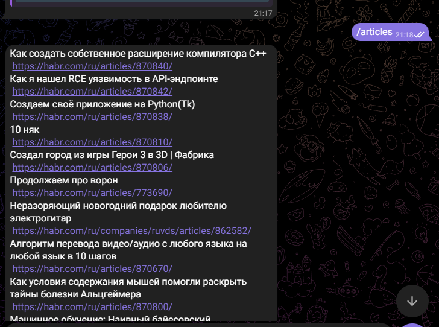
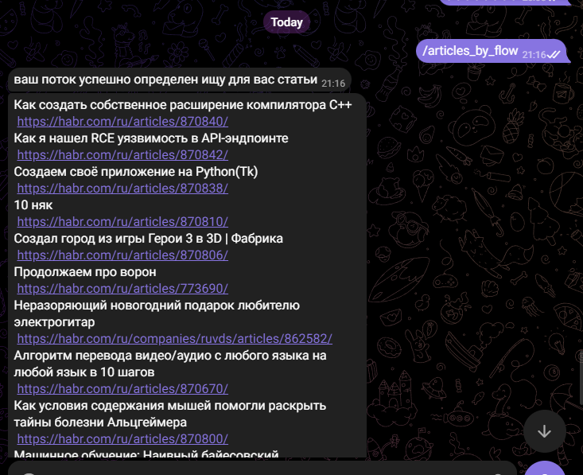

# проект Парсер статей
## Описание: 
 Telegram-бот для просмотра новейших статей с сайта https://habr.com/ru/feed/.
 ### Команды бота:
- /articles: вывести первые десять самых популярных статей со ссылками на них;
- /articles_by_flows: пользователь выбирает в меню один из потоков Хабра, и ему выводится первые десять статей оттуда;
- /complaint: пожаловаться на работу бота. Жалобы сохраняются в файл.
## Технологии использованые в проекте:
- авто браузер с помощью библиотеки selenium
- структура html документа и его парсинг
- встроенные кнопки в телеграме
- сохранение данных в json
## Скриншоты работы бота:
### /articles:

### /articles_by_flow:

### /complaint:
